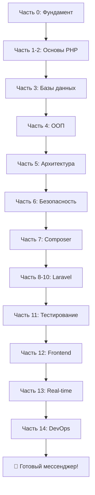

# О проекте

## 👋 Добро пожаловать!

Этот учебник создан для тех, кто хочет научиться веб-разработке на PHP и Laravel с нуля до профессионального уровня.

## 🎯 Цели учебника

### Для начинающих
- Понятное объяснение сложных концепций
- Последовательное изложение от простого к сложному
- Практические примеры из реальной жизни
- Упражнения для закрепления материала

### Для опытных разработчиков
- Глубокое погружение в Laravel
- Лучшие практики и паттерны
- Real-time функционал и WebSockets
- DevOps и деплой приложений

## 📚 Что делает этот учебник особенным?

### 🎓 Комплексный подход
Мы начинаем с абсолютных основ (как работает веб) и заканчиваем созданием полноценного мессенджера с real-time функционалом.

### 💻 Практика, практика, практика
Каждая глава содержит:
- Примеры кода с комментариями
- Упражнения для самостоятельного решения
- Практические задания
- Ссылки на дополнительные материалы

### 🚀 Итоговый проект
К концу учебника ты создашь **полноценный мессенджер** с:
- Регистрацией и авторизацией
- Отправкой сообщений в реальном времени
- Групповыми чатами
- Загрузкой файлов
- Онлайн-статусом пользователей
- Уведомлениями

### 🌟 Современный стек
- PHP 8.1+
- Laravel 11
- MySQL 8.0
- Vue.js 3
- WebSockets (Laravel Reverb)

## 🗺️ Карта обучения

## ⏱️ Сколько времени займёт?

- **Полное прохождение**: 3-6 месяцев (зависит от темпа)
- **Основы PHP**: 2-3 недели
- **Laravel базовый уровень**: 1 месяц
- **Laravel продвинутый**: 1-2 месяца
- **Итоговый проект**: 2-4 недели

## 📖 Как пользоваться учебником?

### Последовательное изучение
Рекомендуется для новичков — проходи главы по порядку, не пропуская.

### Выборочное изучение
Если уже знаешь PHP, можешь сразу перейти к разделам про Laravel.

### Справочник
Используй поиск для быстрого нахождения нужной темы.

## 🤝 Для кого НЕ подходит этот учебник?

- Если вообще не знаешь, что такое программирование (начни с основ алгоритмов)
- Если нужна только документация Laravel (лучше использовать официальную)
- Если ищешь готовые решения без понимания (здесь акцент на глубокое понимание)

## 👨‍💻 Об авторе

Привет! Меня зовут **Jell**.

Я создал этот учебник, потому что когда сам учил PHP и Laravel, мне не хватало:
- Последовательного изложения
- Практических примеров
- Объяснения "зачем", а не только "как"

Этот учебник — результат моего опыта обучения и работы с PHP/Laravel.

## 📞 Обратная связь

Нашли ошибку? Есть предложения? Создайте issue на GitHub!

---

**Готов начать?** → [Глава 0.1: Как работает веб](/chapters/part-0/chapter-0-1)
